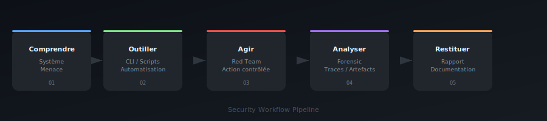
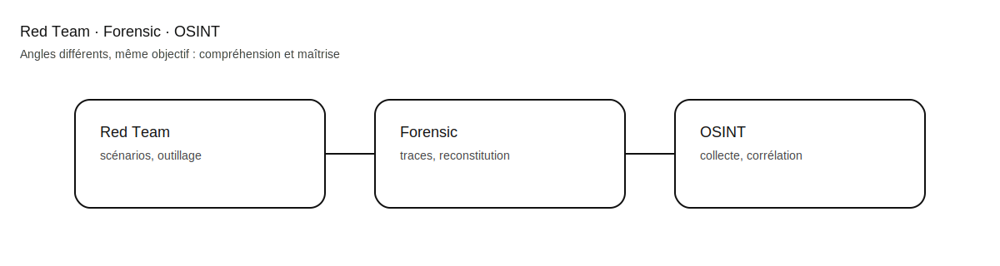

# Anthony — Scribelia

Développement · Red Team · Forensic · OSINT  
Go · C · Python · JavaScript · TypeScript · Linux

---

## À propos

Expert sécurité et développeur, spécialisé dans la compréhension approfondie des systèmes, l’investigation numérique et le développement d’outils techniques.

Travail à l’intersection de :
- la sécurité offensive (Red Team),
- le forensic et l’analyse post-incident,
- l’OSINT technique,
- le développement logiciel bas niveau et applicatif.

Approche pragmatique, orientée maîtrise technique.

---

## Domaines

### Sécurité offensive (Red Team)
- Scénarios offensifs contrôlés
- Analyse de surfaces d’attaque
- Développement d’outils
- Compréhension bas niveau systèmes

### Forensic & Investigation
- Analyse post-incident
- Collecte et corrélation d’artefacts
- Reconstitution de chaînes d’événements
- Traces systèmes et applicatives

### OSINT
- Collecte automatisée de sources ouvertes
- Corrélation et enrichissement
- Exploitation technique

### Développement
- Outils standalone
- Backend (Node.js, APIs REST)
- Sécurité applicative
- CLI / scripting

---

## Stack

- **Langages** : Go, C, Python, JavaScript, TypeScript
- **Environnements** : Linux, Git, CLI, automatisation
- **Web** : Node.js, APIs REST, validation, gestion d’erreurs

---

## Schémas (locaux)

### Workflow sécurité

### Red Team / Forensic / OSINT

---

## Activité GitHub

---

## Projets

Dépôts publics : outils, expérimentations, bases réutilisables et travaux exploratoires.  
Objectif : signal technique réel, pas vitrine marketing.

---

## Contact

GitHub : https://github.com/scribelia-anthony
