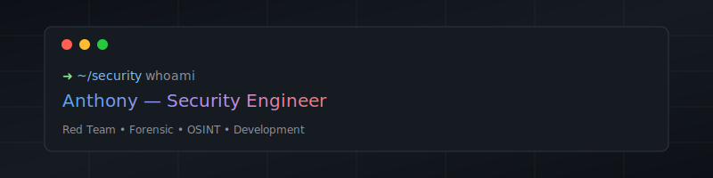
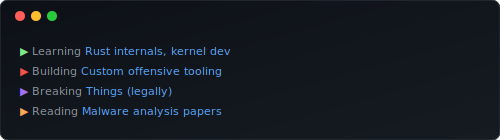

<div align="center">



[](https://golang.org/)
[](https://en.wikipedia.org/wiki/C_(programming_language))
[](https://python.org/)
[](https://typescriptlang.org/)
[](https://developer.mozilla.org/en-US/docs/Web/JavaScript)
[](https://kernel.org/)

</div>

---

### `$ whoami`

Security engineer & developer. Je creuse là où ça fait mal : systèmes, réseaux, binaires.

```
Spécialités : Red Team · Forensic · OSINT · Dev sécurité
Approche    : Comprendre d'abord, outiller ensuite, documenter toujours
```

<br>

## 🔴 Domaines

<table>
<tr>
<td width="50%">

### Offensive Security
- Scénarios Red Team
- Analyse de surfaces d'attaque  
- Développement d'outils offensifs
- Compréhension bas niveau

</td>
<td width="50%">

### Digital Forensics
- Analyse post-incident
- Collecte d'artefacts systèmes
- Reconstitution de timelines
- Memory & disk forensics

</td>
</tr>
<tr>
<td width="50%">

### OSINT
- Collecte automatisée
- Corrélation multi-sources
- Enrichissement technique
- Profiling & attribution

</td>
<td width="50%">

### Development
- Outils CLI standalone
- Backend APIs (Node.js)
- Sécurité applicative
- Automatisation & scripting

</td>
</tr>
</table>

<br>

## 📊 Workflow


<br>

## 🎯 Triad


<br>

## 🛠️ Stack

```yaml
Languages:
  Primary   : [Go, C, Python]
  Secondary : [JavaScript, TypeScript, Bash]

Security:
  Offensive : [Metasploit, Cobalt Strike, custom tooling]
  Forensic  : [Volatility, Autopsy, Sleuth Kit]
  OSINT     : [Maltego, SpiderFoot, custom scrapers]

Development:
  Backend   : [Node.js, Express, REST APIs]
  Tools     : [Git, Docker, Linux, Vim]
  Practices : [CI/CD, testing, documentation]
```

<br>

## ⚡ Currently

<div align="center">



</div>

<br>

## 📂 Projets

Dépôts publics : outils, expérimentations, bases réutilisables.

> Signal technique réel, pas vitrine marketing.

<br>

---

<div align="center">

```
 ██████╗ ██████╗ ███╗   ██╗████████╗ █████╗  ██████╗████████╗
██╔════╝██╔═══██╗████╗  ██║╚══██╔══╝██╔══██╗██╔════╝╚══██╔══╝
██║     ██║   ██║██╔██╗ ██║   ██║   ███████║██║        ██║   
██║     ██║   ██║██║╚██╗██║   ██║   ██╔══██║██║        ██║   
╚██████╗╚██████╔╝██║ ╚████║   ██║   ██║  ██║╚██████╗   ██║   
 ╚═════╝ ╚═════╝ ╚═╝  ╚═══╝   ╚═╝   ╚═╝  ╚═╝ ╚═════╝   ╚═╝   
```

<a href="https://github.com/scribelia-anthony">
  
</a>

<br><br>

<sub>

`Security is not a product, but a process.` — Bruce Schneier

</sub>

<br>


</div>
